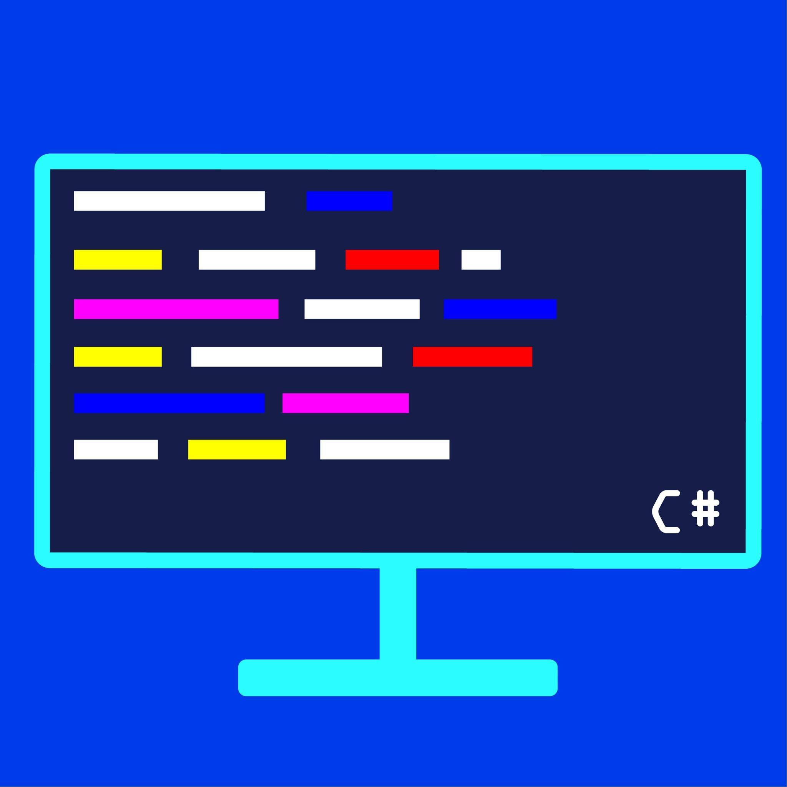

 

## Junior Developer 👋 Ömer Yaman

  
<b>✨&nbsp;&nbsp;About&nbsp;Me</b>

   

I am a Junior Developer with 5+ years of experience in developing softwares, games, websites and more.

 

  
<b>🛠️&nbsp;&nbsp;Technologies</b>

   
  

🔗 &nbsp;**Connect with me**
  

